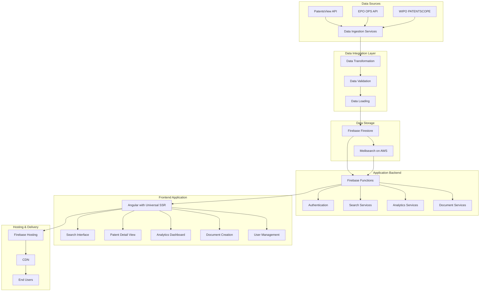
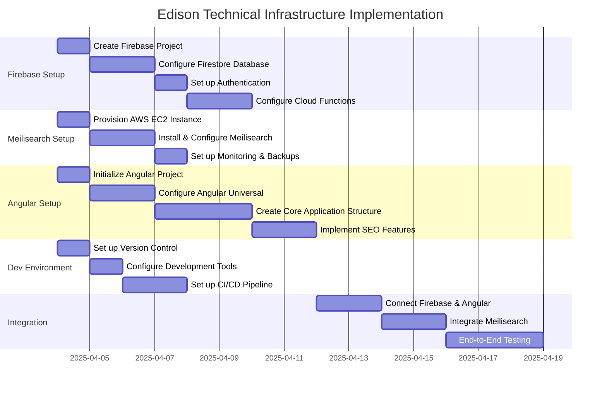

# Edison Technical Infrastructure Plan

## Overview

This document outlines the technical infrastructure plan for the Edison patent information application (rebranded from IP Insight). The plan focuses on setting up the core technical components required for the application, including:

1. Firebase project with Firestore database
2. Meilisearch instance on AWS
3. Angular application with Angular Universal (SSR)
4. Development environment configuration

## Infrastructure Architecture

## 1. Firebase Project Setup

### 1.1 Project Creation and Configuration

1. Create a new Firebase project named "Edison"
2. Configure Firebase project settings with Blaze Plan (pay-as-you-go)
3. Enable required Firebase services:
   - Firestore
   - Authentication
   - Cloud Functions
   - Hosting
   - Storage (for document attachments)

### 1.2 Firestore Database Setup

**Database Structure:**
- `patents/` - Patent documents with nested fields for basic info, inventors, assignees, etc.
- `inventors/` - Inventor information with references to patents
- `assignees/` - Assignee information with references to patents
- `users/` - User profiles, preferences, saved searches, and saved patents

**Indexing Strategy:**
- Create compound indexes for frequent query patterns
- Optimize for common search and filtering operations

**Security Rules:**
- Public read access for patent data
- Authenticated access for user-specific data
- Admin-only write access for patent data

### 1.3 Firebase Authentication Setup

- Configure Email/Password and Google Sign-In methods
- Set up user roles (Anonymous, Registered, Premium, Admin)
- Implement secure authentication flows

### 1.4 Firebase Cloud Functions

**Function Categories:**
1. **Data Integration Functions** - For patent data ingestion and processing
2. **Search Functions** - For handling search queries and similar patent finding
3. **User Functions** - For user profile and preference management
4. **SSR Functions** - For Angular Universal server-side rendering

## 2. Meilisearch on AWS Setup

### 2.1 AWS Infrastructure

- Provision t3.medium EC2 instance in us-east-1 region
- Configure security groups to allow access only from Firebase Functions
- Assign Elastic IP for consistent access
- Set up 100GB SSD storage initially

### 2.2 Meilisearch Installation and Configuration

- Install Meilisearch on Ubuntu Server 20.04 LTS
- Configure as a systemd service for automatic startup
- Set up master key and API keys for secure access

**Index Configuration:**
- Configure searchable attributes (title, abstract, claims, inventors, assignees)
- Set up filterable attributes (dates, classifications, locations)
- Define custom ranking rules and synonyms dictionary

### 2.3 Meilisearch Security and Monitoring

- Create separate API keys for different access levels
- Set up CloudWatch monitoring for resource utilization
- Implement daily backups to S3 with lifecycle policies

## 3. Angular Application Setup

### 3.1 Project Initialization

- Create new Angular project with routing and SCSS styling
- Add Angular Universal for server-side rendering
- Configure project structure following best practices

### 3.2 Project Structure

- Organize code into core, shared, and feature modules
- Implement lazy loading for better performance
- Set up proper asset organization

### 3.3 Core Dependencies

- Angular 15+ with Angular Universal
- Firebase/AngularFire for Firebase integration
- Meilisearch JS client for search functionality
- RxJS for reactive programming

### 3.4 Angular Universal (SSR) Configuration

- Configure server-side rendering for SEO optimization
- Set up Express server for SSR
- Implement transfer state for improved performance

### 3.5 SEO Implementation

- Create MetaService for dynamic metadata management
- Implement structured data markup for patent information
- Set up robots.txt and automated sitemap generation
- Configure canonical URLs and social media tags

## 4. Development Environment Configuration

### 4.1 Local Development Setup

- Configure development environment with necessary tools
- Set up Firebase emulators for local testing
- Create development scripts for common tasks

### 4.2 Environment Configuration

- Create environment-specific configuration files
- Securely manage API keys and credentials
- Configure different environments (dev, staging, prod)

### 4.3 CI/CD Pipeline Setup

- Set up GitHub Actions workflow for automated builds and deployments
- Configure testing in the CI pipeline
- Implement deployment to Firebase hosting

### 4.4 Testing Configuration

- Configure Karma for unit testing
- Set up Cypress for end-to-end testing
- Implement test coverage reporting

## 5. Scalability Considerations

### 5.1 Firebase Scalability

- Optimize Firestore for performance with proper indexing
- Configure Cloud Functions for efficient execution
- Implement caching strategies where appropriate

### 5.2 Meilisearch Scaling

- Initial t3.medium instance can handle ~5,000 concurrent users
- Plan for vertical scaling (larger instances) as needed
- Consider horizontal scaling options for future growth

### 5.3 Angular Application Scaling

- Implement lazy loading and code splitting
- Optimize bundle sizes
- Use service workers for improved performance

## 6. Implementation Timeline

## 7. Next Steps

1. Create Firebase project and configure initial settings
2. Provision AWS EC2 instance for Meilisearch
3. Initialize Angular project with Angular Universal
4. Set up development environment and CI/CD pipeline
5. Begin implementation of core functionality

## 8. Conclusion

This technical infrastructure plan provides a comprehensive roadmap for setting up the Edison patent information application. By following this plan, we will establish a solid foundation that supports the application's requirements for data storage, search capabilities, and SEO optimization while ensuring scalability to handle 5,000 concurrent users initially.
