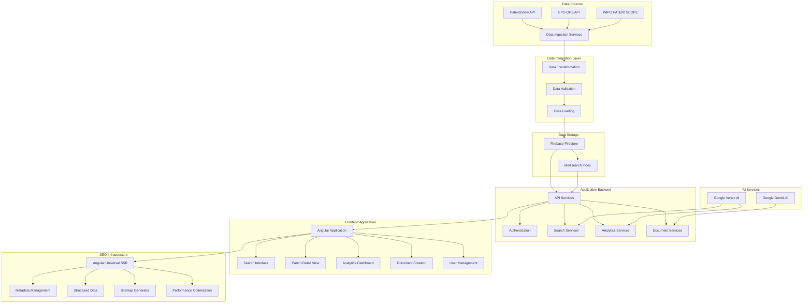
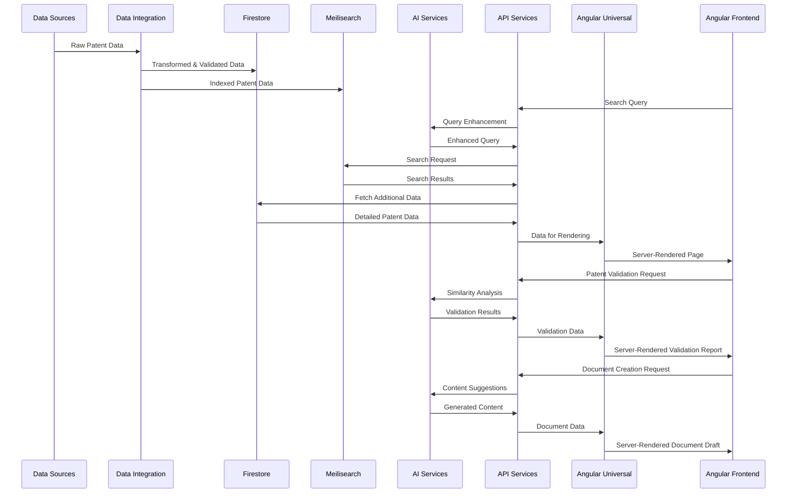

# IP Insight: Comprehensive Implementation Plan

## Executive Summary

This implementation plan provides a structured roadmap for developing the IP Insight patent information application, focusing on delivering a Minimum Viable Product (MVP) with semantic search capabilities as quickly as possible. The plan balances parallel work streams across brand identity, technical infrastructure, and data integration, while accounting for the constraints of a small development team with limited AI expertise.

The plan is organized into four phases:
1. **Foundation & MVP** (8 weeks)
2. **Enhanced Functionality** (8 weeks)
3. **Advanced Features** (12 weeks)
4. **Expansion & Optimization** (Ongoing)

Each phase includes specific deliverables, timelines, and resource allocations to ensure efficient progress toward a market-ready product. A strong emphasis is placed on SEO optimization throughout the development process to ensure maximum visibility and discoverability of the platform.

## Phase 1: Foundation & MVP (8 Weeks)

### 1.1 Brand Identity Development (Weeks 1-4)

#### Objectives:
- Establish a cohesive brand identity for IP Insight
- Create visual assets for the application and marketing materials
- Develop brand positioning and messaging strategy
- Define SEO-friendly naming conventions and content strategy

#### Deliverables:
- Finalized logo and visual identity system
- Brand style guide (typography, color palette, imagery guidelines)
- Brand messaging framework and value proposition
- Basic marketing website design with SEO optimization
- Keyword research and content strategy document

#### Timeline:
- **Week 1**: Brand strategy workshop, market research, keyword research
- **Week 2**: Logo concepts and initial visual identity development
- **Week 3**: Refinement and finalization of visual identity
- **Week 4**: Style guide creation and brand asset production, SEO strategy documentation

#### Resources:
- 0.5 FTE developer time (for technical input)
- External design resources as needed
- SEO specialist consultation (if available)

### 1.2 Technical Infrastructure Setup (Weeks 1-4)

#### Objectives:
- Establish the core technical foundation for the application
- Configure development, staging, and production environments
- Set up CI/CD pipeline for efficient deployment
- Implement Angular Universal for Server-Side Rendering (SSR)

#### Deliverables:
- Configured Firebase project with Firestore database
- Meilisearch instance setup and configured
- Angular frontend project scaffolding with Angular Universal (SSR)
- API service layer architecture
- Development, staging, and production environments
- CI/CD pipeline for automated testing and deployment
- SEO-friendly URL structure implementation

#### Timeline:
- **Week 1**: Environment setup, Firebase project configuration
- **Week 2**: Meilisearch instance setup, initial schema design
- **Week 3**: Angular project scaffolding with SSR setup, core components
- **Week 4**: API service layer architecture, CI/CD pipeline setup, URL structure implementation

#### Resources:
- 1.5 FTE developer time
- Firebase account with appropriate plan
- Meilisearch hosting (cloud or self-hosted)

### 1.3 Data Integration Foundation (Weeks 2-6)

#### Objectives:
- Establish connections to primary patent data sources
- Develop initial data models and transformation pipeline
- Implement basic data ingestion processes

#### Deliverables:
- PatentsView API integration
- Initial unified patent data schema
- Basic data transformation pipeline
- Data validation mechanisms
- Initial Firestore database structure
- Basic Meilisearch index configuration

#### Timeline:
- **Week 2**: Apply for API access credentials (PatentsView)
- **Week 3-4**: PatentsView API client development
- **Week 4-5**: Data model and transformation pipeline
- **Week 5-6**: Initial data loading and validation

#### Resources:
- 1 FTE developer time
- API access credentials for PatentsView

### 1.4 Semantic Search MVP (Weeks 5-8)

#### Objectives:
- Implement core search functionality with semantic capabilities
- Develop basic user interface for patent search
- Integrate Google Vertex AI for semantic understanding
- Ensure search results are SEO-friendly and crawlable

#### Deliverables:
- Search API endpoints
- Meilisearch integration with semantic enhancements
- Basic search interface with filters
- Patent detail view with structured data markup
- Google Vertex AI integration for query understanding
- MVP deployment to staging environment
- SEO-optimized patent detail pages with proper metadata

#### Timeline:
- **Week 5-6**: Search API development, Meilisearch configuration
- **Week 6-7**: Search UI development, basic filters, SEO metadata implementation
- **Week 7**: Patent detail view implementation with structured data markup
- **Week 8**: Vertex AI integration, testing, and deployment

#### Resources:
- 2 FTE developer time
- Google Vertex AI account and API access

### 1.5 SEO Foundation Implementation (Weeks 5-8)

#### Objectives:
- Establish core SEO infrastructure and best practices
- Implement server-side rendering for optimal crawlability
- Create metadata management system
- Set up initial sitemap generation

#### Deliverables:
- Server-side rendering implementation with Angular Universal
- Metadata management system for dynamic page titles and descriptions
- Structured data markup for patent information (Schema.org)
- Initial XML sitemap generation process
- Robots.txt configuration
- SEO monitoring setup (Google Search Console integration)

#### Timeline:
- **Week 5-6**: SSR implementation and testing
- **Week 6-7**: Metadata management system development
- **Week 7**: Structured data markup implementation
- **Week 8**: Sitemap generation, robots.txt, and monitoring setup

#### Resources:
- 1 FTE developer time
- SEO specialist consultation (if available)

### 1.6 MVP Launch Preparation (Week 8)

#### Objectives:
- Ensure MVP is ready for internal testing and limited external use
- Prepare documentation and onboarding materials
- Plan for feedback collection and iteration

#### Deliverables:
- MVP deployed to production environment
- Basic user documentation
- Feedback collection mechanism
- Internal testing plan
- SEO validation report

#### Timeline:
- **Week 8**: Final testing, documentation, and deployment

#### Resources:
- 2 FTE developer time
- All team members for testing

## Phase 2: Enhanced Functionality (8 Weeks)

### 2.1 Brand Experience Enhancement (Weeks 9-12)

#### Objectives:
- Refine user experience based on MVP feedback
- Enhance visual design and interaction patterns
- Develop comprehensive marketing materials
- Optimize content for search engines

#### Deliverables:
- Refined UI/UX based on user feedback
- Enhanced visual components and animations
- Comprehensive marketing website with SEO optimization
- User onboarding materials
- Content strategy implementation with SEO focus

#### Timeline:
- **Week 9-10**: Collect and analyze MVP feedback
- **Week 10-11**: UI/UX refinements
- **Week 11-12**: Marketing website enhancement with SEO optimization

#### Resources:
- 0.5 FTE developer time
- External design resources as needed

### 2.2 Data Integration Expansion (Weeks 9-14)

#### Objectives:
- Integrate additional patent data sources
- Enhance data transformation and quality processes
- Implement incremental update mechanisms

#### Deliverables:
- EPO OPS API integration
- Enhanced data transformation pipeline
- Data deduplication mechanisms
- Incremental update processes
- Data quality monitoring dashboard

#### Timeline:
- **Week 9-10**: Apply for EPO OPS access, initial integration
- **Week 11-12**: Enhanced transformation pipeline
- **Week 13-14**: Deduplication and incremental updates

#### Resources:
- 1 FTE developer time
- API access credentials for EPO OPS

### 2.3 Search Functionality Enhancement (Weeks 9-16)

#### Objectives:
- Enhance search capabilities with advanced filters and facets
- Implement saved searches and history
- Develop basic patent analytics
- Optimize search results for SEO

#### Deliverables:
- Advanced search filters and facets
- Saved searches functionality
- Search history tracking
- Basic patent analytics dashboard
- Enhanced patent detail view with citations and family information
- SEO-optimized search results pages with proper pagination
- Enhanced structured data markup

#### Timeline:
- **Week 9-10**: Advanced filters and facets
- **Week 11-12**: Saved searches and history
- **Week 13-14**: Enhanced patent detail view with improved SEO
- **Week 15-16**: Basic analytics dashboard

#### Resources:
- 1.5 FTE developer time

### 2.4 User Management System (Weeks 13-16)

#### Objectives:
- Implement comprehensive user management
- Develop user profiles and preferences
- Implement authentication and authorization

#### Deliverables:
- User registration and authentication
- User profiles and preferences
- Role-based access control
- Account management features

#### Timeline:
- **Week 13-14**: Authentication and basic user profiles
- **Week 15-16**: Preferences and access control

#### Resources:
- 1 FTE developer time

### 2.5 Advanced SEO Implementation (Weeks 9-16)

#### Objectives:
- Enhance SEO capabilities across the application
- Implement advanced structured data
- Develop automated sitemap generation
- Optimize for search engine crawlability

#### Deliverables:
- Advanced structured data implementation (BreadcrumbList, SearchAction, etc.)
- Automated sitemap generation with change frequency and priority
- Canonical URL implementation
- Hreflang tags for future multi-language support
- Performance optimization for Core Web Vitals
- SEO analytics dashboard

#### Timeline:
- **Week 9-10**: Advanced structured data implementation
- **Week 11-12**: Automated sitemap generation system
- **Week 13-14**: Canonical URL and hreflang implementation
- **Week 15-16**: Performance optimization and analytics dashboard

#### Resources:
- 0.5 FTE developer time
- SEO specialist consultation (if available)

## Phase 3: Advanced Features (12 Weeks)

### 3.1 AI-Powered Patent Validation (Weeks 17-22)

#### Objectives:
- Implement AI-assisted patent validation workflows
- Develop similarity matching algorithms
- Create validation reports and recommendations

#### Deliverables:
- Patent validation workflow
- Similarity detection using Google Vertex AI
- Validation report generation
- Recommendation engine for potential conflicts
- SEO-optimized validation report pages

#### Timeline:
- **Week 17-18**: Validation workflow design
- **Week 19-20**: Similarity detection implementation
- **Week 21-22**: Report generation and recommendations

#### Resources:
- 1.5 FTE developer time
- Google Vertex AI for similarity detection

### 3.2 Advanced Analytics & Visualizations (Weeks 17-24)

#### Objectives:
- Develop comprehensive patent analytics
- Create interactive visualizations
- Implement trend analysis and forecasting
- Ensure visualizations are SEO-friendly

#### Deliverables:
- Patent landscape visualizations
- Technology trend analysis
- Competitive intelligence tools
- Custom reporting options
- SEO-friendly data visualization pages with proper metadata
- Exportable and shareable reports with social metadata

#### Timeline:
- **Week 17-20**: Core analytics and basic visualizations
- **Week 21-24**: Advanced visualizations and trend analysis

#### Resources:
- 1 FTE developer time
- Visualization libraries (D3.js, Chart.js, etc.)

### 3.3 Document Creation Assistant (Weeks 23-28)

#### Objectives:
- Implement basic document creation workflows
- Develop templates for patent applications
- Integrate AI for content suggestions

#### Deliverables:
- Document creation workflow
- Patent application templates
- AI-assisted content suggestions using Google Genkit AI
- Document export functionality
- SEO-optimized document template pages

#### Timeline:
- **Week 23-24**: Document workflow and templates
- **Week 25-26**: AI integration for suggestions
- **Week 27-28**: Export functionality and refinement

#### Resources:
- 1.5 FTE developer time
- Google Genkit AI for content generation

### 3.4 Integration & Performance Optimization (Weeks 25-28)

#### Objectives:
- Ensure seamless integration of all features
- Optimize performance and scalability
- Enhance error handling and resilience
- Optimize Core Web Vitals for SEO

#### Deliverables:
- Performance optimization report
- Scalability enhancements
- Comprehensive error handling
- System monitoring dashboard
- Core Web Vitals optimization
- Lighthouse score improvements
- Mobile optimization

#### Timeline:
- **Week 25-26**: Integration testing and optimization
- **Week 27-28**: Monitoring and error handling

#### Resources:
- 1 FTE developer time

### 3.5 SEO Expansion & Optimization (Weeks 17-28)

#### Objectives:
- Expand SEO capabilities to new features
- Optimize for voice search and featured snippets
- Implement advanced analytics for SEO performance
- Develop content strategy for organic growth

#### Deliverables:
- Voice search optimization
- Featured snippet targeting for patent information
- Advanced SEO analytics integration
- Content expansion strategy
- Internal linking optimization
- SEO A/B testing framework

#### Timeline:
- **Week 17-20**: Voice search and featured snippet optimization
- **Week 21-24**: Advanced analytics implementation
- **Week 25-28**: Content strategy and internal linking optimization

#### Resources:
- 0.5 FTE developer time
- Content strategist (if available)

## Phase 4: Expansion & Optimization (Ongoing)

### 4.1 Additional Data Source Integration

#### Objectives:
- Integrate WIPO PATENTSCOPE and other supplementary sources
- Expand international patent coverage
- Enhance data quality and completeness
- Ensure new data sources are SEO-optimized

#### Deliverables:
- WIPO PATENTSCOPE integration
- Additional supplementary source integrations
- Enhanced international patent coverage
- Data quality improvements
- SEO strategy for international patent content

### 4.2 Advanced AI Capabilities

#### Objectives:
- Enhance AI capabilities across the application
- Implement advanced natural language processing
- Develop predictive analytics for patent trends

#### Deliverables:
- Enhanced semantic understanding
- Predictive analytics for technology trends
- Advanced document creation assistance
- AI-powered patent drafting suggestions
- AI-generated SEO recommendations

### 4.3 Multi-language Support

#### Objectives:
- Implement multi-language support for interface and search
- Develop cross-language patent search capabilities
- Support international patent documentation
- Implement proper SEO for multi-language content

#### Deliverables:
- Localized user interface
- Cross-language search capabilities
- Multi-language document support
- Translation assistance for patent documents
- Hreflang implementation for language variants
- Language-specific sitemaps
- International SEO strategy

### 4.4 Continuous Improvement & Market Expansion

#### Objectives:
- Continuously improve based on user feedback
- Expand market reach and user base
- Develop additional features based on market needs
- Refine SEO strategy based on performance data

#### Deliverables:
- Regular feature updates
- Market expansion strategy
- User feedback integration process
- Continuous improvement framework
- SEO performance analysis and optimization
- Content freshness strategy

## SEO Strategy

### Core SEO Principles

#### 1. Technical SEO Foundation
- **Server-Side Rendering (SSR)**: Implement Angular Universal to ensure all pages are fully rendered on the server before being sent to the client, improving crawlability and initial load performance.
- **Semantic HTML Structure**: Use proper HTML5 semantic elements throughout the application to clearly communicate content structure to search engines.
- **Mobile Optimization**: Ensure responsive design and mobile-friendly experience as mobile-first indexing is now standard.
- **Core Web Vitals Optimization**: Focus on Largest Contentful Paint (LCP), First Input Delay (FID), and Cumulative Layout Shift (CLS) metrics to improve search ranking.
- **Site Speed Optimization**: Implement code splitting, lazy loading, image optimization, and caching strategies to maximize performance.

#### 2. Content SEO Strategy
- **Keyword Research & Implementation**: Conduct comprehensive keyword research for patent-related terms and implement strategically throughout the application.
- **Unique Metadata**: Generate unique, descriptive titles and meta descriptions for all pages, including dynamically generated patent detail pages.
- **Content Hierarchy**: Implement clear H1-H6 heading structure to communicate content importance and relationships.
- **Rich Content**: Develop informative, valuable content around patent topics, search strategies, and intellectual property concepts.
- **Featured Snippet Optimization**: Structure content to target featured snippet opportunities for patent-related queries.

#### 3. Structured Data Implementation
- **Schema.org Markup**: Implement comprehensive structured data using JSON-LD format:
  - Patent information (custom schema)
  - BreadcrumbList for navigation paths
  - SearchAction for internal search functionality
  - Organization for company information
  - WebPage for general page information
  - Article for blog/informational content
- **Rich Results Testing**: Regularly validate structured data implementation using Google's Rich Results Test tool.

#### 4. Crawlability & Indexation
- **XML Sitemap**: Implement automated sitemap generation with:
  - Change frequency and priority attributes
  - Last modification dates
  - Segmentation for large sites
  - Automatic submission to search engines
- **Robots.txt**: Configure properly to guide crawler behavior and prevent crawling of non-valuable pages.
- **Canonical URLs**: Implement canonical tags to prevent duplicate content issues, especially for filtered search results.
- **Pagination SEO**: Implement proper rel="next" and rel="prev" for paginated content.

#### 5. User Experience & Engagement
- **Search Intent Alignment**: Ensure page content aligns with user search intent for patent-related queries.
- **Dwell Time Optimization**: Create engaging, valuable content that keeps users on the page.
- **Internal Linking Strategy**: Implement strategic internal linking to distribute page authority and guide users to important content.
- **Click-Through Rate Optimization**: Craft compelling titles and meta descriptions to improve SERP click-through rates.

### SEO Implementation Roadmap

#### Phase 1: Technical Foundation (Weeks 1-8)
- Implement Angular Universal for SSR
- Configure proper URL structure with SEO-friendly patterns
- Set up basic metadata management system
- Implement initial XML sitemap generation
- Configure robots.txt
- Set up Google Search Console and basic monitoring

#### Phase 2: Content & Structure Enhancement (Weeks 9-16)
- Implement comprehensive structured data markup
- Develop automated metadata generation for dynamic pages
- Enhance sitemap with priority, change frequency, and segmentation
- Implement canonical URL strategy
- Optimize for Core Web Vitals
- Develop initial content strategy for key patent topics

#### Phase 3: Advanced SEO Implementation (Weeks 17-28)
- Optimize for voice search and featured snippets
- Implement advanced analytics for SEO performance tracking
- Develop internal linking strategy
- Implement A/B testing for SEO elements
- Optimize for international audiences (foundation for multi-language)
- Develop content freshness strategy

#### Phase 4: Continuous Optimization (Ongoing)
- Regular SEO audits and performance analysis
- Competitive analysis and strategy adjustments
- Content expansion based on search trends
- Technical SEO refinements
- International SEO expansion
- Voice search optimization enhancements

### Automated SEO Processes

#### Sitemap Generation
- **Automated Process**: Implement a scheduled job that:
  1. Scans the application for all public routes and dynamic content
  2. Generates XML sitemaps with appropriate metadata
  3. Segments sitemaps if they exceed size limits
  4. Updates the sitemap index file
  5. Submits updated sitemaps to search engines via their APIs
- **Change Detection**: Implement a change detection system that tracks content updates and modifies sitemap entries accordingly
- **Priority Assignment**: Develop an algorithm that assigns priority values based on content importance, update frequency, and user engagement metrics

#### Metadata Management
- **Dynamic Generation**: Create a system that automatically generates unique, relevant metadata for:
  - Patent detail pages based on patent title, inventors, and key claims
  - Search result pages based on search parameters
  - Analytics pages based on visualization content
  - Document templates based on document type and purpose
- **Metadata Testing**: Implement automated testing to ensure metadata meets length requirements and contains targeted keywords
- **A/B Testing**: Develop capability to test different metadata variations for impact on click-through rates

#### Structured Data Automation
- **Template-Based Generation**: Create templates for different structured data types that can be populated dynamically
- **Validation Pipeline**: Implement automated validation of structured data as part of the CI/CD process
- **Schema Evolution**: Design a flexible system that can adapt to schema.org changes and new structured data opportunities

## Implementation Architecture

### System Architecture Diagram

### Data Flow Architecture

## Resource Requirements

### Development Team

| Role | Allocation | Responsibilities |
|------|------------|------------------|
| Full-Stack Developer #1 | 100% | Technical lead, architecture, backend services |
| Full-Stack Developer #2 | 100% | Frontend development, UI/UX implementation, SSR |
| Full-Stack Developer #3 | 100% | Data integration, API development, SEO implementation |

### External Resources

| Resource | Purpose | Timeline |
|----------|---------|----------|
| UI/UX Designer | Brand identity, interface design | Phases 1-2 |
| SEO Specialist | SEO strategy, implementation guidance | Phases 1-2 |
| AI/ML Consultant | AI integration guidance | As needed |
| QA Tester | Quality assurance | Before major releases |

### Infrastructure

| Component | Specification | Cost Estimate |
|-----------|---------------|---------------|
| Firebase | Blaze Plan (pay as you go) | $100-300/month |
| Meilisearch | Cloud hosting or self-hosted | $50-200/month |
| Google Vertex AI | Pay per use | $100-500/month |
| Google Genkit AI | Pay per use | $50-200/month |
| CI/CD Pipeline | GitHub Actions or similar | $0-50/month |
| Monitoring Tools | Firebase Monitoring + custom | $0-100/month |
| SEO Tools | Search Console, Lighthouse, etc. | $0-100/month |

## Risk Assessment & Mitigation

| Risk | Impact | Likelihood | Mitigation Strategy |
|------|--------|------------|---------------------|
| API rate limits | High | Medium | Implement caching, batch processing, throttling |
| Data quality issues | High | Medium | Robust validation, error reporting, manual review processes |
| Limited AI expertise | Medium | High | Leverage Google's AI services, consider AI consultant |
| Timeline constraints | High | Medium | Focus on MVP, prioritize features, iterative development |
| Resource limitations | Medium | High | Efficient resource allocation, clear prioritization |
| Integration complexity | High | Medium | Modular architecture, thorough testing, phased approach |
| User adoption challenges | Medium | Medium | Early user testing, feedback incorporation, intuitive UX |
| SEO implementation complexity | Medium | Medium | Phased approach, focus on core technical SEO first |
| SSR performance issues | Medium | Medium | Performance monitoring, optimization, caching strategies |

## Success Metrics

### MVP Phase
- Successful integration with PatentsView API
- Functional semantic search capability
- Basic patent detail view
- Initial user feedback collection
- Google Search Console setup with initial indexing
- Core Web Vitals baseline measurements

### Enhanced Functionality Phase
- Integration with EPO OPS
- User account creation and management
- Advanced search filters and facets
- Saved searches and history tracking
- Improved search engine visibility (indexed pages)
- Structured data implementation validation
- Sitemap coverage metrics

### Advanced Features Phase
- Patent validation workflow implementation
- Interactive patent analytics
- Document creation assistant
- Performance optimization metrics
- Organic search traffic growth
- Keyword ranking improvements
- Page speed and Core Web Vitals improvements

## Next Steps

1. **Immediate Actions (Next 2 Weeks)**
   - Finalize development team roles and responsibilities
   - Set up development environment and repository
   - Apply for API access credentials
   - Begin brand identity workshop
   - Initialize Firebase project and Meilisearch instance
   - Set up Angular project with Angular Universal (SSR)
   - Conduct initial SEO keyword research

2. **Key Decisions Required**
   - Finalize hosting infrastructure decisions
   - Confirm AI service integration approach
   - Determine MVP feature scope
   - Establish development sprint cadence
   - Approve SEO strategy and priorities

3. **Dependencies to Resolve**
   - API access approval timelines
   - External resource availability
   - Technical skill gaps assessment
   - Infrastructure cost approvals
   - SEO expertise acquisition

## Conclusion

This implementation plan provides a comprehensive roadmap for developing the IP Insight patent information application, with a focus on delivering an MVP with semantic search capabilities as quickly as possible while ensuring strong SEO foundations. By pursuing parallel work streams across brand identity, technical infrastructure, and data integration, while leveraging Google's AI services to compensate for limited AI expertise, the plan enables efficient progress toward a market-ready product.

The phased approach allows for iterative development and validation, focusing first on core functionality and gradually expanding to more advanced features. The implementation of Angular Universal for server-side rendering, comprehensive metadata management, and automated sitemap generation ensures the application will be fully optimized for search engines from the beginning, maximizing visibility and organic traffic potential.

With careful execution of this plan, the IP Insight team can deliver a revolutionary patent information platform that democratizes access to patent intelligence, provides valuable tools for inventors and organizations of all sizes, and achieves strong visibility in search engines to drive organic user acquisition.
